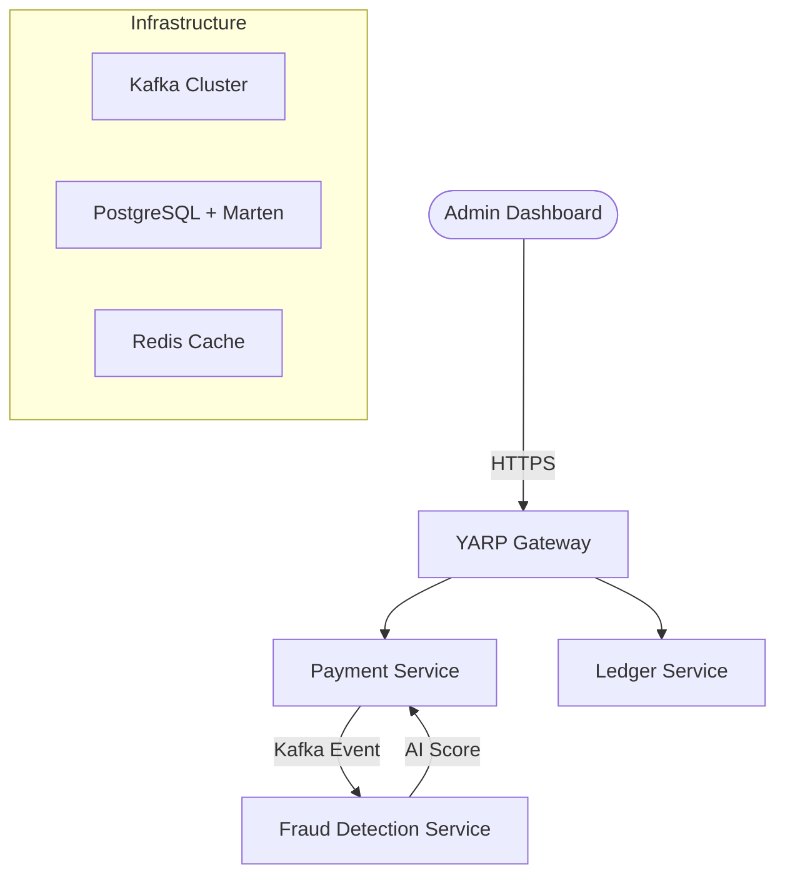

# 💳 Fintech Payment Hub — DDD/CQRS Enterprise

[](https://dotnet.microsoft.com/en-us/download/dotnet/10.0)
[](https://nextjs.org/)

A multi-rail payment orchestration platform powered by **.NET 10** microservices. This enterprise-grade solution integrates AI-driven fraud detection via **Semantic Kernel** and event-driven ledger tracking.

---

## 🏗️ Core Architecture

The system follows a **Clean Architecture** approach with **DDD** and **CQRS**.



---

## 🚀 Key Features

*   **DDD/CQRS**: Domain-driven design with MediatR for clean separation of commands and queries.
*   **AI Fraud Agent**: Intelligent risk scoring using **Semantic Kernel** (GPT-4o-mini).
*   **Event Sourcing**: Full audit trail using **Marten** on PostgreSQL.
*   **YARP Gateway**: High-performance reverse proxy with rate limiting.
*   **Observability**: Integrated **OpenTelemetry** for full-stack tracing.

---

## 🛠️ Service Overview

| Service | Technology | Responsibility |
| :--- | :--- | :--- |
| **ApiGateway.YARP** | .NET 10, YARP | Routing, Rate Limiting, Auth |
| **Payment Service** | Minimal API, EF Core | Payment Orchestration, DDD |
| **Fraud Service** | Worker, Semantic Kernel | AI Transaction Analysis |
| **Ledger Service** | Marten, Event Store | Immutable Ledger, Reporting |

---

## ⚙️ Quick Start

### 1. Prerequisites
- [.NET 10 SDK](https://dotnet.microsoft.com/en-us/download/dotnet/10.0)
- [Docker & Docker Compose](https://www.docker.com/products/docker-desktop/)
- **OpenAI API Key** (for Fraud Agent)

### 2. Environment Setup
Create a `.env` file in the root:
```env
OPENAI_API_KEY=your_key_here
```

### 3. Launch the Stack
```bash
docker-compose up --build
```

---


